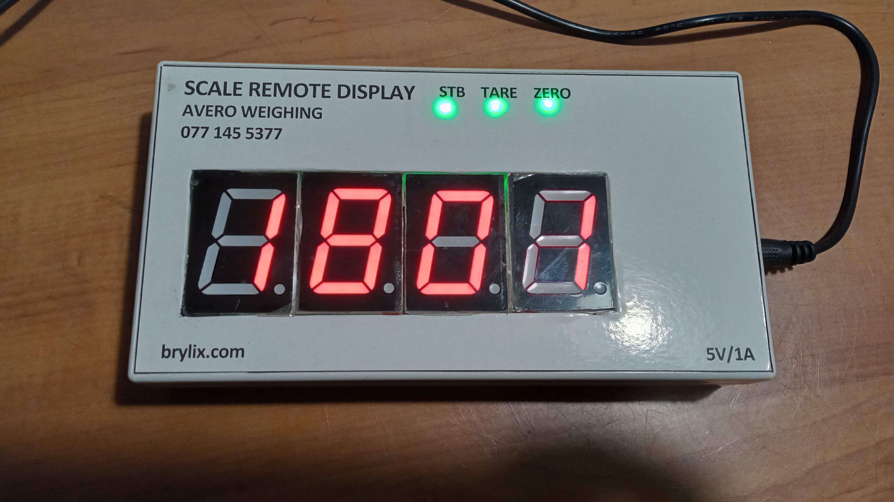
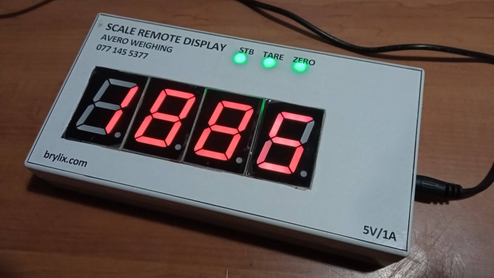
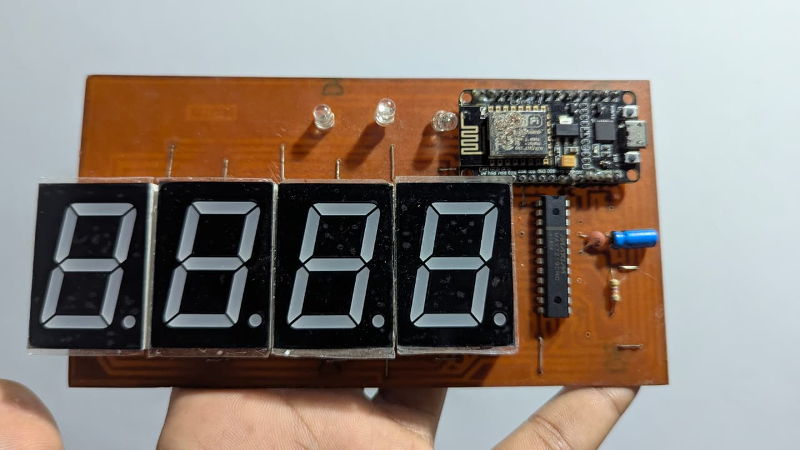

# ⚖️ Industrial IoT Weighing System

  <strong>Custom-built remote weighing display featuring an in-house fabricated PCB, ESP8266 connectivity, and a large four-digit 7-segment display.</strong>

  

---

## 📌 Overview

This project is a custom **industrial weighing / scale remote display system** developed as a complete electronics build, from PCB layout and fabrication through component assembly and final enclosure integration.

The finished unit provides a large, easy-to-read **four-digit 7-segment display** together with **STB, TARE, and ZERO** status indicators. An **ESP8266** is integrated into the electronics platform for IoT/connectivity capability.

## ✨ Project Highlights

- ⚖️ Remote display for a weighing/scale system
- 🔢 Large four-digit 7-segment readout
- 🟢 STB, TARE and ZERO status indicators
- 📡 ESP8266-based connectivity
- 🧩 Custom control/display PCB
- 🛠️ PCB fabricated and assembled in-house
- 📦 Completed enclosed working unit

## 🔧 Development & Fabrication

A major part of this project was producing the electronics board in-house. The work covered the complete development cycle:

1. Circuit and PCB development
2. In-house board fabrication and preparation
3. Component assembly and validation
4. ESP8266 and display integration
5. Enclosure integration and final testing

This portfolio documents the completed system and assembled electronics without publishing reproducible board artwork, manufacturing data, or editable design files.

## 🧠 Electronics

| Component / Area | Role |
| --- | --- |
| **ESP8266** | IoT/connectivity-enabled controller |
| **4 × large 7-segment displays** | Remote weight/readout display |
| **Status LEDs** | STB, TARE and ZERO indication |
| **Custom PCB** | Integrates the controller, display and supporting electronics |
| **5V / 1A input** | Power specification shown on the finished unit |

## 🛠️ Engineering Areas

`PCB Design` · `PCB Fabrication` · `Embedded Systems` · `ESP8266` · `IoT` · `Electronics Assembly` · `Industrial Weighing`

## 📷 Project Gallery

<table>
  <tr>
    <td width="50%" align="center">
       
      <strong>Completed Remote Display</strong> Four-digit readout with STB, TARE and ZERO indicators.
    </td>
    <td width="50%" align="center">
       
      <strong>Enclosed Working Unit</strong> Finished 5V display hardware ready for use.
    </td>
  </tr>
  <tr>
    <td colspan="2" align="center">
       
      <strong>Assembled IoT Display Electronics</strong> ESP8266 controller, display modules and status indicators on the completed board.
    </td>
  </tr>
</table>

> **Design protection:** Reproducible PCB artwork, schematics, Gerber files, editable CAD, manufacturing data, firmware source, STL files, dimensions, and other production-ready materials are intentionally not published. This repository is a portfolio showcase, not an open-source hardware release.

---

## 👨‍💻 Developed by

**Theviru Lakwan**  
Mechatronics Engineer · PCB Designer · IoT Developer · Entrepreneur

[LinkedIn](https://linkedin.com/in/theviru-lakwan-7758a41b8) · [GitHub](https://github.com/MrTheviru)

---

### Intellectual Property

© 2021–2026 Theviru Lakwan. All rights reserved.

This repository is provided for portfolio and demonstration purposes. No permission is granted to copy, modify, manufacture, distribute, sublicense, or commercially use the project designs, documentation, or other original materials without prior written permission from the author.
